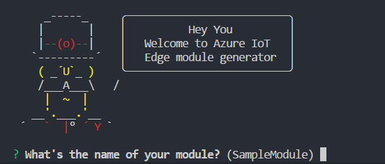

# Azure IoT Edge Node.js Module Generator

`generator-azure-iot-edge-module` creates a base template to start a new Azure IoT Edge Node.js module

## Install
```
$ npm i -g yo generator-azure-iot-edge-module
```

## Usage
```
$ yo azure-iot-edge-module
```



If you prefer one-liner:
```
$ yo azure-iot-edge-module -n <module_name> -r <image_repository>
```

For example:
```
$ yo azure-iot-edge-module -n filterModule -r localhost:5000/filtermodule
```

## Build, deploy and run the module

Check out the [document](https://docs.microsoft.com/en-us/azure/iot-edge/tutorial-nodejs-module).

Learn more about Azure IoT Edge [here](https://docs.microsoft.com/en-us/azure/iot-edge/).

## Contributing

This project welcomes contributions and suggestions.  Most contributions require you to agree to a
Contributor License Agreement (CLA) declaring that you have the right to, and actually do, grant us
the rights to use your contribution. For details, visit https://cla.microsoft.com.

When you submit a pull request, a CLA-bot will automatically determine whether you need to provide
a CLA and decorate the PR appropriately (e.g., label, comment). Simply follow the instructions
provided by the bot. You will only need to do this once across all repos using our CLA.

This project has adopted the [Microsoft Open Source Code of Conduct](https://opensource.microsoft.com/codeofconduct/).
For more information see the [Code of Conduct FAQ](https://opensource.microsoft.com/codeofconduct/faq/) or
contact [opencode@microsoft.com](mailto:opencode@microsoft.com) with any additional questions or comments.
